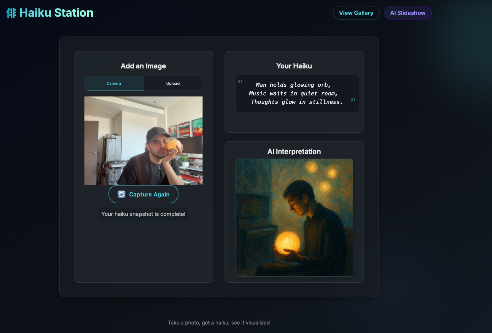

# Haiku Snapshot 🌿

Capture a moment, receive an AI haiku, and see it reimagined as art.

## Features ✨
- Live camera capture or drag-and-drop uploads
- GPT-4 turns each image into a 5-7-5 haiku
- The haiku seeds an abstract image via OpenAI's image model
- Gallery and ambient slideshow keep your best haikus on display

## Quick Start
1. `npm install`
2. Create `.env.local` with `OPENAI_API_KEY=...`
3. `npm start` to init the database and launch on `http://localhost:3002`

## Tech Stack
- Backend: Node.js + Express with Multer uploads
- Database: SQLite (local file in `data/`)
- AI: OpenAI GPT-4 for text, GPT-Image for visuals
- Frontend: Vanilla JS, HTML, CSS

## Deployment Notes
- Set `OPENAI_API_KEY` and optionally `PORT` in your hosting environment
- Mount persistent storage for `data/db.sqlite` and update `dbPath` if needed
- Start command: `npm start`

## Endpoints
- `GET /` camera capture experience
- `POST /upload` image + haiku pipeline
- `GET /gallery` latest creations
- `GET /stream` JSON feed of recent entries

## License
ISC

## Thanks
OpenAI • Express • Multer • SQLite
